# TestCases

## TC-01 Создание нового пользователя
**Описание:**
Проверка корректного создания нового профиля.

**Предусловия:**
Приложение запущено. Пользователь не авторизован.

**Последовательность действий:**
1. Запустить приложение.
2. На вопрос `Войти в существующий профиль? [y/n]` ввести `n`.
3. Ввести логин `ivan`.
4. Ввести пароль `12345`.
5. Ввести имя `Ivan`.
6. Ввести фамилию `Petrov`.
7. Ввести год рождения `2000`.

**Ожидаемый результат:**
- Профиль успешно создан.
- Пользователь автоматически авторизован.
- В консоли отображается приветствие.

**Скриншоты:**
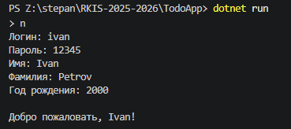

---

## TC-02 Вход в существующий профиль
**Описание:**
Проверка корректного входа в ранее созданный профиль.

**Предусловия:**
Профиль `ivan` уже существует.

**Последовательность действий:**
1. Запустить приложение.
2. На вопрос `Войти в существующий профиль? [y/n]` ввести `y`.
3. Ввести логин `ivan`.
4. Ввести пароль `12345`.

**Ожидаемый результат:**
- Пользователь успешно входит в систему.
- В консоли отображается приветствие.

**Скриншоты:**
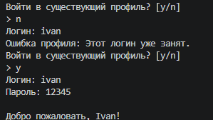

---

## TC-03 Ошибка входа с неверным паролем
**Описание:**
Проверка обработки неверного пароля при входе.

**Предусловия:**
Профиль `ivan` существует.

**Последовательность действий:**
1. Запустить приложение.
2. Выбрать вход в существующий профиль.
3. Ввести логин `ivan`.
4. Ввести пароль `00000`.

**Ожидаемый результат:**
- Вход не выполняется.
- В консоли выводится сообщение об ошибке профиля.

**Скриншоты:**
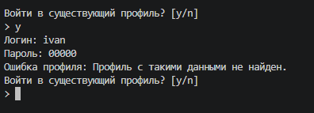

---

## TC-04 Ошибка создания профиля с занятым логином
**Описание:**
Проверка запрета регистрации с уже существующим логином.

**Предусловия:**
Профиль `ivan` уже существует.

**Последовательность действий:**
1. Запустить приложение.
2. Выбрать создание нового профиля.
3. Ввести логин `ivan`.

**Ожидаемый результат:**
- Новый профиль не создаётся.
- В консоли выводится сообщение о занятом логине.

**Скриншоты:**
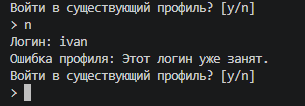

---

## TC-05 Ошибка создания профиля с пустым логином
**Описание:**
Проверка валидации пустого логина.

**Предусловия:**
Приложение запущено.

**Последовательность действий:**
1. Выбрать создание нового профиля.
2. На вводе логина нажать `Enter`, не вводя значение.

**Ожидаемый результат:**
- Профиль не создаётся.
- В консоли выводится сообщение об ошибке аргумента.

**Скриншоты:**
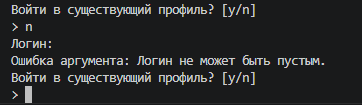

---

## TC-06 Просмотр текущего профиля
**Описание:**
Проверка команды `profile`.

**Предусловия:**
Пользователь авторизован.

**Последовательность действий:**
1. Ввести команду `profile`.

**Ожидаемый результат:**
- В консоли отображается информация о текущем профиле.

**Скриншоты:**
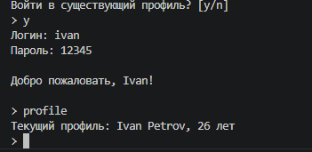

---

## TC-07 Выход из профиля
**Описание:**
Проверка команды `profile -o`.

**Предусловия:**
Пользователь авторизован.

**Последовательность действий:**
1. Ввести команду `profile -o`.

**Ожидаемый результат:**
- Выполняется выход из профиля.
- Программа снова предлагает вход или создание нового профиля.

**Скриншоты:**
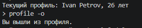

---

## TC-08 Отображение справки
**Описание:**
Проверка команды `help`.

**Предусловия:**
Пользователь авторизован.

**Последовательность действий:**
1. Ввести команду `help`.

**Ожидаемый результат:**
- В консоли отображается список доступных команд.

**Скриншоты:**
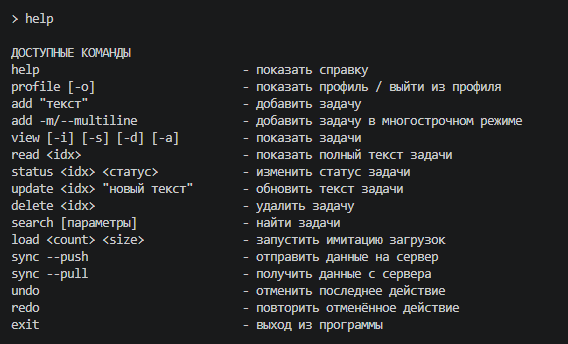

---

## TC-09 Добавление задачи одной строкой
**Описание:**
Проверка команды `add`.

**Предусловия:**
Пользователь авторизован.

**Последовательность действий:**
1. Ввести команду `add "Купить молоко"`.

**Ожидаемый результат:**
- Задача добавляется.
- В консоли отображается сообщение об успешном добавлении.

**Скриншоты:**
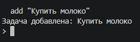

---

## TC-10 Ошибка добавления пустой задачи
**Описание:**
Проверка запрета на добавление пустого текста задачи.

**Предусловия:**
Пользователь авторизован.

**Последовательность действий:**
1. Ввести команду `add ""`.

**Ожидаемый результат:**
- Задача не создаётся.
- Выводится сообщение об ошибке аргумента.

**Скриншоты:**
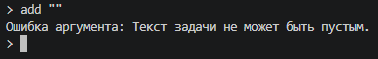

---

## TC-11 Добавление многострочной задачи
**Описание:**
Проверка команды `add -m`.

**Предусловия:**
Пользователь авторизован.

**Последовательность действий:**
1. Ввести команду `add -m`.
2. Ввести строку `Первая строка`.
3. Ввести строку `Вторая строка`.
4. Ввести `!end`.

**Ожидаемый результат:**
- Многострочная задача успешно добавляется.
- В консоли выводится сообщение об успешном добавлении.

**Скриншоты:**
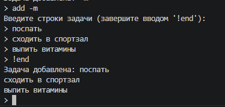

---

## TC-12 Просмотр списка задач
**Описание:**
Проверка команды `view`.

**Предусловия:**
У пользователя есть хотя бы две задачи.

**Последовательность действий:**
1. Ввести команду `view`.

**Ожидаемый результат:**
- В консоли отображается таблица задач.

**Скриншоты:**
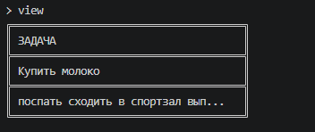

---

## TC-13 Просмотр задач со всеми колонками
**Описание:**
Проверка команды `view -a`.

**Предусловия:**
У пользователя есть задачи.

**Последовательность действий:**
1. Ввести команду `view -a`.

**Ожидаемый результат:**
- Отображаются индекс, текст, статус и дата изменения.

**Скриншоты:**
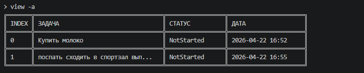

---

## TC-14 Чтение полной задачи
**Описание:**
Проверка команды `read`.

**Предусловия:**
Есть хотя бы одна задача.

**Последовательность действий:**
1. Ввести команду `read 0`.

**Ожидаемый результат:**
- В консоли отображается полный текст задачи, её статус и дата изменения.

**Скриншоты:**
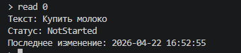

---

## TC-15 Ошибка чтения несуществующей задачи
**Описание:**
Проверка обработки неверного индекса в команде `read`.

**Предусловия:**
Количество задач меньше 100.

**Последовательность действий:**
1. Ввести команду `read 100`.

**Ожидаемый результат:**
- В консоли выводится сообщение об ошибке задачи.

**Скриншоты:**
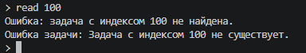

---

## TC-16 Обновление текста задачи
**Описание:**
Проверка команды `update`.

**Предусловия:**
Есть хотя бы одна задача.

**Последовательность действий:**
1. Ввести команду `update 0 "Купить хлеб"`.

**Ожидаемый результат:**
- Текст задачи обновляется.
- В консоли выводится сообщение об успешном обновлении.

**Скриншоты:**
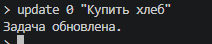

---

## TC-17 Ошибка обновления с пустым текстом
**Описание:**
Проверка запрета пустого текста при команде `update`.

**Предусловия:**
Есть хотя бы одна задача.

**Последовательность действий:**
1. Ввести команду `update 0 ""`.

**Ожидаемый результат:**
- Текст задачи не обновляется.
- Выводится сообщение об ошибке аргумента.

**Скриншоты:**
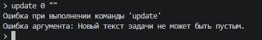

---

## TC-18 Изменение статуса задачи
**Описание:**
Проверка команды `status`.

**Предусловия:**
Есть хотя бы одна задача.

**Последовательность действий:**
1. Ввести команду `status 0 inprogress`.

**Ожидаемый результат:**
- Статус задачи изменяется на `InProgress`.
- В консоли выводится сообщение об успешном изменении.

**Скриншоты:**
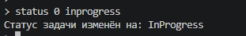

---

## TC-19 Ошибка изменения статуса с неверным значением
**Описание:**
Проверка валидации неверного статуса.

**Предусловия:**
Есть хотя бы одна задача.

**Последовательность действий:**
1. Ввести команду `status 0 wrongstatus`.

**Ожидаемый результат:**
- Статус не изменяется.
- В консоли выводится сообщение об ошибке аргумента.

**Скриншоты:**
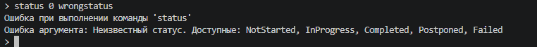

---

## TC-20 Удаление задачи
**Описание:**
Проверка команды `delete`.

**Предусловия:**
Есть хотя бы одна задача.

**Последовательность действий:**
1. Ввести команду `delete 0`.

**Ожидаемый результат:**
- Задача удаляется из списка.
- В консоли отображается сообщение об успешном удалении.

**Скриншоты:**
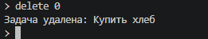

---

## TC-21 Отмена последнего действия
**Описание:**
Проверка команды `undo`.

**Предусловия:**
Перед этим выполнена изменяющая команда, например `delete`.

**Последовательность действий:**
1. Ввести команду `undo`.

**Ожидаемый результат:**
- Последнее действие отменяется.
- Состояние списка задач возвращается к предыдущему.

**Скриншоты:**
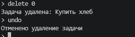

---

## TC-22 Повтор отменённого действия
**Описание:**
Проверка команды `redo`.

**Предусловия:**
Перед этим выполнена команда `undo`.

**Последовательность действий:**
1. Ввести команду `redo`.

**Ожидаемый результат:**
- Отменённое действие выполняется повторно.

**Скриншоты:**
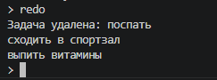

---

## TC-23 Ошибка undo при пустом стеке
**Описание:**
Проверка обработки команды `undo`, когда нет действий для отмены.

**Предусловия:**
После входа не было выполнено изменяющих команд.

**Последовательность действий:**
1. Ввести команду `undo`.

**Ожидаемый результат:**
- В консоли отображается сообщение об ошибке.
- Программа продолжает работу.

**Скриншоты:**
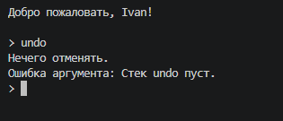

---

## TC-24 Поиск задач по содержимому текста
**Описание:**
Проверка команды `search --contains`.

**Предусловия:**
Есть задачи, одна из которых содержит слово `milk`.

**Последовательность действий:**
1. Ввести команду `search --contains "milk"`.

**Ожидаемый результат:**
- Отображаются только задачи, содержащие `milk`.

**Скриншоты:**
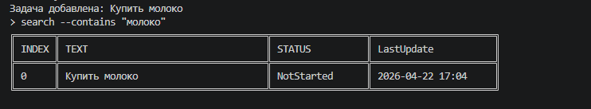

---

## TC-25 Поиск задач с сортировкой по дате
**Описание:**
Проверка команды `search --sort date --desc`.

**Предусловия:**
Есть несколько задач с разной датой изменения.

**Последовательность действий:**
1. Ввести команду `search --sort date --desc`.

**Ожидаемый результат:**
- Задачи выводятся в порядке убывания даты изменения.

**Скриншоты:**
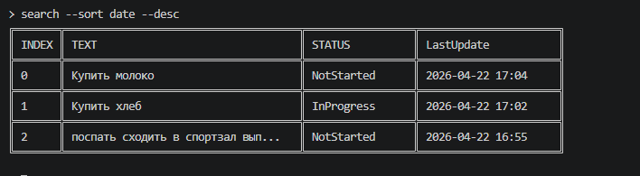

---

## TC-26 Ошибка поиска с неверной датой
**Описание:**
Проверка обработки неверного формата даты в команде `search`.

**Предусловия:**
Пользователь авторизован.

**Последовательность действий:**
1. Ввести команду `search --from 2026/01/01`.

**Ожидаемый результат:**
- В консоли выводится сообщение об ошибке аргумента.
- Программа продолжает работу.

**Скриншоты:**
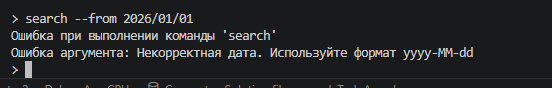

---

## TC-27 Имитация загрузки
**Описание:**
Проверка команды `load`.

**Предусловия:**
Пользователь авторизован.

**Последовательность действий:**
1. Ввести команду `load 3 20`.

**Ожидаемый результат:**
- В консоли отображаются прогресс-бары.
- После завершения выводится сообщение `Все загрузки завершены.`

**Скриншоты:**
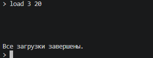

---

## TC-28 Ошибка команды load с неверными аргументами
**Описание:**
Проверка валидации аргументов команды `load`.

**Предусловия:**
Пользователь авторизован.

**Последовательность действий:**
1. Ввести команду `load 0 10`.

**Ожидаемый результат:**
- Команда не выполняется.
- В консоли выводится сообщение об ошибке аргумента.

**Скриншоты:**
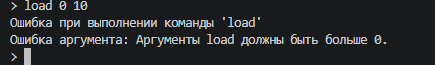

---

## TC-29 Синхронизация при недоступном сервере
**Описание:**
Проверка команды `sync --push`, если HTTP-сервер не запущен.

**Предусловия:**
Сервер синхронизации не запущен.

**Последовательность действий:**
1. Ввести команду `sync --push`.

**Ожидаемый результат:**
- В консоли отображается сообщение `Ошибка: сервер недоступен.`

**Скриншоты:**
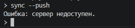

---

## TC-30 Сохранение данных после перезапуска приложения
**Описание:**
Проверка сохранения данных в SQLite после повторного запуска.

**Предусловия:**
Пользователь авторизован.

**Последовательность действий:**
1. Добавить задачу командой `add "Проверка сохранения"`.
2. Завершить приложение командой `exit`.
3. Запустить приложение повторно.
4. Войти под тем же пользователем.
5. Ввести команду `view`.

**Ожидаемый результат:**
- Ранее добавленная задача присутствует в списке.
- Данные успешно загружаются из базы `todos.db`.

**Скриншоты:**
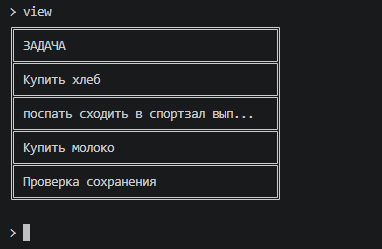
